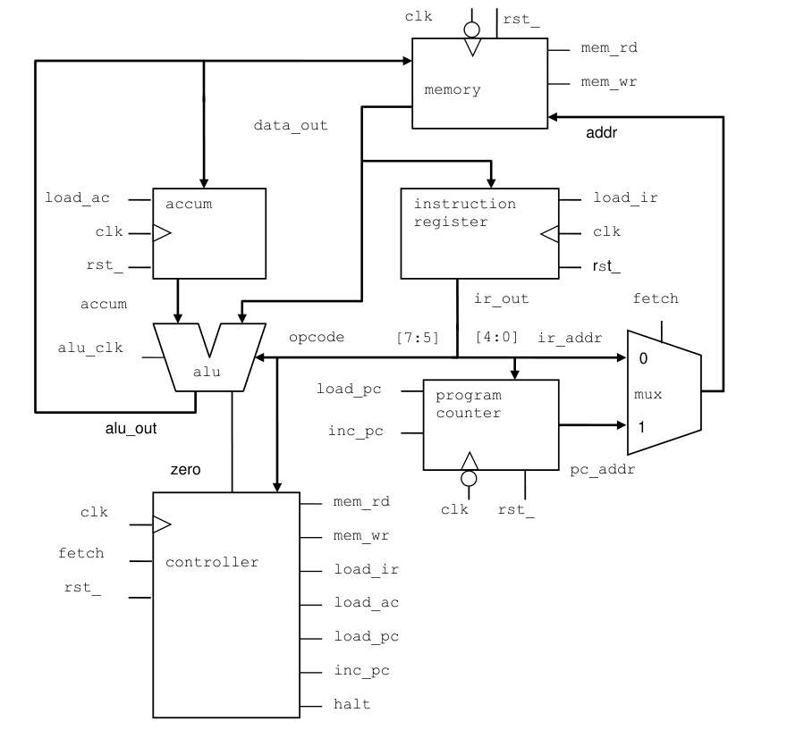

# VeriRISC
Very Reduced Instruction Set Computer CPU

> **Course Reference:** SystemVerilog for Design and Verification — Engineer Explorer Series
> Cadence Design Systems | Course Version 25.03

## Project Overview

This project features the design, implementation, and verification of the **VeriRISC CPU**. The development process follows an incremental, module-based approach aligned with industry-standard hardware description and verification practices (Cadence training curriculum).

The VeriRISC CPU successfully implements a complete **Instruction Cycle** (Fetch, Decode, Execute, and Write-back) and operates continuously until an **HLT** (Halt) instruction is decoded.

## CPU Model

The overall CPU structure is shown below.

---

## CPU Architecture & Specifications

The VeriRISC CPU is built from modular hardware blocks interacting over a synchronized system bus.

### Core Components

| Component | Module | Description |
|---|---|---|
| Program Counter | `counter` | Generates and holds the current execution address for the program space. |
| Address MUX | `scale_mux` | Multiplexer selecting the next memory address source between the current program counter or the immediate address field embedded within an instruction. |
| Instruction Register | `register` | Captures and holds the incoming instruction opcodes and operands fetched from memory. |
| Accumulator Register | `register` | High-speed internal storage register that captures output data directly from the ALU. |
| ALU | `alu` | Computational engine processing mathematical, logical, and shifting operations. Evaluates inputs from memory, the accumulator, and the opcode field of the instruction. |
| Memory Block | `memory` | Unified memory space housing both system instructions (program code) and data operands. |

### Instruction Execution Cycle

1. **Fetch** — Pulls the instruction opcode from the memory block at the address pointed to by the counter.
2. **Decode** — Decodes the instruction inside the control unit to route operands and prepare execution paths.
3. **Operand Fetch** — Retrieves data operands from memory if mandated by the specific opcode.
4. **Execute** — The ALU processes the decoded operation, utilizing data from the accumulator or memory.
5. **Write-back** — Stores execution results back into either the internal accumulator register or external system memory.

---

## Development & Curriculum Modules

The project was designed and verified incrementally through specialized technical modules.

### Phase 1: Structural RTL Design

#### Module 3 — Procedural Statements & Blocks
- Developed the basic **register** component using sequential procedural blocks.
- Designed the combinatorial **mux** block to handle clean address routing.

#### Module 5 — Operations
- Modeled the **counter** (Program Counter) focusing on arithmetic operators and reset/increment controls.

#### Module 6 — User-Defined Types (FSM)
- Engineered the central **CPU controller state machine** utilizing custom SystemVerilog types (`typedef enum`) to handle the instruction cycle states safely.

#### Module 7 — Hierarchy & Datapath
- Integrated complex behavioral modeling to build the **ALU**, encapsulating execution operations inside structured user-defined types.

---

### Phase 2: Verification, Subprograms & Interfaces

#### Module 9 — Tasks & Functions
- Created the `mem_test` module utilizing enhanced subprograms (blocking/non-blocking tasks) to independently validate the course provided memory subsystem.

#### Module 10 — Advanced Interfaces & System Assembly
- Wrapped design signals into a structural SystemVerilog interface (`mem_intf_tb`).
- Implemented explicit **modports** to enforce directional pin-mapping policies between the testbench, test modules, and design elements to eliminate simulation race conditions.
- Successfully assembled and top-level verified the complete, integrated VeriRISC CPU model.

---

## Verification Strategy

The verification environment is written entirely in **SystemVerilog**, separating test concerns from hardware execution.

### Interface-Driven Design
Connections between the testbench components and the RTL blocks utilize encapsulated interfaces rather than loose, error-prone wire mapping.

### Directional Safety (modports)
Enforces strict Master/Slave/Monitor signal restrictions to trap structural wiring bugs at compile time.

### Task-Based Verification
Reusable verification tasks mimic memory bus traffic to rigorously validate read/write boundaries, timing delays, and propagation windows.