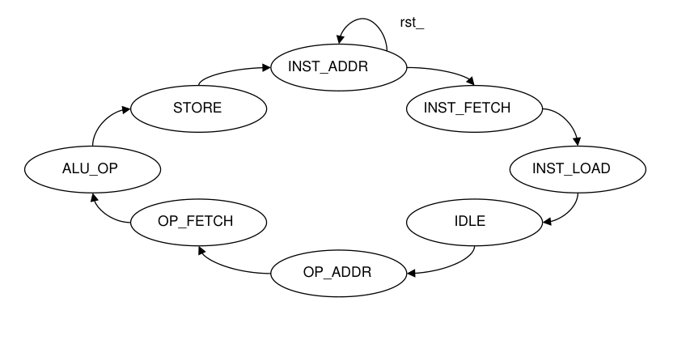
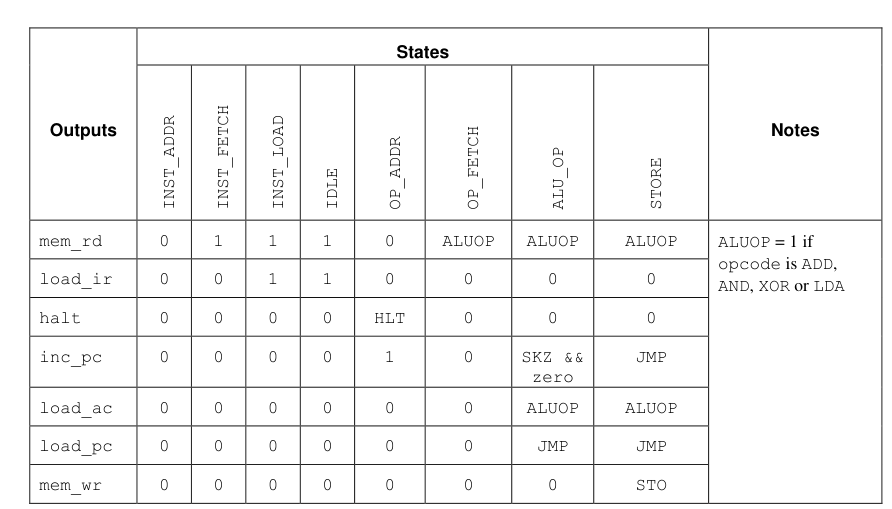

# VeriRISC
Very Reduced Instruction Set Computer CPU

> **Course Reference:** SystemVerilog for Design and Verification — Engineer Explorer Series
> Cadence Design Systems | Course Version 25.03

## Project Overview

This project features the design, implementation, and verification of the **VeriRISC CPU**. The development process follows an incremental, module-based approach aligned with industry-standard hardware description and verification practices (Cadence training curriculum).

The VeriRISC CPU successfully implements a complete **Instruction Cycle** (Fetch, Decode, Execute, and Write-back) and operates continuously until an **HLT** (Halt) instruction is decoded.

## CPU Model

The overall CPU structure is shown below.


---

## CPU Architecture & Specifications

The VeriRISC CPU is built from modular hardware blocks interacting over a synchronized system bus.

### Core Components

| Component | Module | Description |
|---|---|---|
| Program Counter | `counter` | Generates and holds the current execution address for the program space. |
| Address MUX | `scale_mux` | Multiplexer selecting the next memory address source between the current program counter or the immediate address field embedded within an instruction. |
| Instruction Register | `register` | Captures and holds the incoming instruction opcodes and operands fetched from memory. |
| Accumulator Register | `register` | High-speed internal storage register that captures output data directly from the ALU. |
| ALU | `alu` | Computational engine processing mathematical, logical, and shifting operations. Evaluates inputs from memory, the accumulator, and the opcode field of the instruction. |
| Memory Block | `memory` | Unified memory space housing both system instructions (program code) and data operands. |

### Instruction Execution Cycle

1. **Fetch** — Pulls the instruction opcode from the memory block at the address pointed to by the counter.
2. **Decode** — Decodes the instruction inside the control unit to route operands and prepare execution paths.
3. **Operand Fetch** — Retrieves data operands from memory if mandated by the specific opcode.
4. **Execute** — The ALU processes the decoded operation, utilizing data from the accumulator or memory.
5. **Write-back** — Stores execution results back into either the internal accumulator register or external system memory.


---
 
## Instruction Set Architecture (ISA)
 
The VeriRISC CPU implements a minimal 8-instruction ISA, where each instruction is encoded as a 3-bit opcode. This compact design covers the essential operations for arithmetic, logic, memory access, flow control, and CPU management — sufficient to run complete programs on the RISC datapath.
 
### Opcode Encoding
 
| Opcode | Encoding | CPU Operation |
|---|---|---|
| `HLT` | `000` | Halt — stops CPU execution |
| `SKZ` | `001` | Skip next instruction if zero flag is set |
| `ADD` | `010` | Add memory data to accumulator |
| `AND` | `011` | Bitwise AND of memory data and accumulator |
| `XOR` | `100` | Bitwise XOR of memory data and accumulator |
| `LDA` | `101` | Load accumulator from memory |
| `STO` | `110` | Store accumulator to memory |
| `JMP` | `111` | Jump to immediate address |
 
### Control Unit Output Signals
 
The controller FSM drives the following output signals each cycle to coordinate datapath operations:
 
| Output Signal | Function |
|---|---|
| `mem_rd` | Memory read |
| `load_ir` | Load instruction register |
| `halt` | Halt |
| `inc_pc` | Increment program counter |
| `load_ac` | Load accumulator |
| `load_pc` | Load program counter |
| `mem_wr` | Memory write |

The controller have 8 stages, which represented by the following state transition:



The output control signal logic are the following:


 
---

## Development & Curriculum Modules

The project was designed and verified incrementally through specialized technical modules.

### Phase 1: Structural RTL Design

#### Module 3 — Procedural Statements & Blocks
- Developed the basic **register** component using sequential procedural blocks.
- Designed the combinatorial **mux** block to handle clean address routing.

#### Module 5 — Operations
- Modeled the **counter** (Program Counter) focusing on arithmetic operators and reset/increment controls.

#### Module 6 — User-Defined Types (FSM)
- Engineered the central **CPU controller state machine** utilizing custom SystemVerilog types (`typedef enum`) to handle the instruction cycle states safely.

#### Module 7 — Hierarchy & Datapath
- Integrated complex behavioral modeling to build the **ALU**, encapsulating execution operations inside structured user-defined types.

---

### Phase 2: Verification, Subprograms & Interfaces

#### Module 9 — Tasks & Functions
- Created the `mem_test` module utilizing enhanced subprograms (blocking/non-blocking tasks) to independently validate the course provided memory subsystem.

#### Module 10 — Advanced Interfaces & System Assembly
- Wrapped design signals into a structural SystemVerilog interface (`mem_intf_tb`).
- Implemented explicit **modports** to enforce directional pin-mapping policies between the testbench, test modules, and design elements to eliminate simulation race conditions.
- Successfully assembled and top-level verified the complete, integrated VeriRISC CPU model.

---

## Verification Strategy

The testbench loads a pre-assembled program into the CPU's unified memory
and runs it to completion. The program is structured as a self-checking
routine — correctness is encoded in the program flow itself rather than
external signal inspection.

**Pass/Fail is determined by which `HLT` the CPU reaches:**

- Throughout the program, each `SKZ` + `HLT` pair acts as a **checkpoint
  trap**. If the preceding operation produced the correct result (zero),
  `SKZ` skips over the `HLT` and execution continues. If the result is
  wrong (non-zero), `SKZ` does not skip — the CPU falls into that `HLT`
  immediately, which the testbench flags as a **FAIL**.
- The **single correct `HLT`** at the end of the program is only reachable if every checkpoint was passed — meaning
  every operation produced the expected result and every trap was skipped.
  Reaching this `HLT` is the **PASS** condition.

The testbench monitors the `halt` control signal and validates the program counter against the expected final address:
 
| Test | Program | Expected PC at HALT |
|---|---|---|
| `CPUtest1` | Basic CPU Diagnostic | `0x17` |
| `CPUtest2` | Advanced CPU Diagnostic | `0x10` |
| `CPUtest3` | Fibonacci Numbers to 144 | `0x0C` |
| `CPUtest4` | *(custom — in progress)* | TBD |
 
---
## Extension: Single-Level Subroutine Call & Return (`JRA`)
 
The base VeriRISC ISA has no `CALL`/`RET` mechanism — `JMP` only supports a fixed immediate target baked into the instruction at compile time, so a function has no way to know where to return to. This extension adds minimal hardware to support **one level** of subroutine call and return, without widening the opcode field.
### Design
 
Rather than introducing a new opcode (which would require widening from 3 bits to 4 and re-encoding every existing program), the extension **reserves a sentinel operand value within the existing `JMP` opcode**:
 
```
jra = (ir == 8'hFF)   ; JMP with operand 0xFF means "return," not "jump to 0xFF"
```
 
| Signal | Behavior |
|---|---|
| `sto_pc` | Asserted when `opcode == JMP && ~jra` — every *normal* jump (a "call") latches the current PC into the new Return Address register before jumping. |
| `ra_out` | Drives the RA register's contents onto the PC load path. |
| `jra` | When set, the counter loads `PC ← RA` instead of the instruction's immediate field. |
 
### New Hardware
 
- **RA Register** — a new register (same structure as the existing accumulator) that holds the single saved return address.
- **Counter modification** — the `counter` module gains a `jra` input; when asserted, it sources its next value from `RA` instead of the immediate address field.
### Known Limitations
 
- **Single level only** — no call stack. A second `JMP` (call) before a `JRA` (return) overwrites RA, so calling a function from within a function will lose the original return address. Recursion and nested calls are not supported.
- **Reserved operand** — address `0xFF` can no longer be used as a real jump target. This is safe given the program memory range used by current tests, but is a permanent constraint on the address space.
- **No call-before-return guard** — if `JRA` executes before any normal `JMP` has run, RA is undefined.
### Future Work
 
A full call stack (register array or memory-backed, with a stack pointer) would remove the single-level restriction and enable recursive/nested calls. This was scoped but not implemented, as it requires datapath changes beyond a single register and mux input.
 
---
## Attribution & File Ownership
 
This project was developed as part of the **Cadence Engineer Explorer Series — SystemVerilog for Design and Verification (Course Version 25.03)**.
 
Some files in this repository originate from Cadence course materials and are not original work:
 
| File | Status | Notes |
|---|---|---|
| `mem.sv` | Cadence-provided | Unmodified course material |
| `cpu.sv` | Cadence-provided | Unmodified course material |
| `cpu_tb_1.sv` / `cpu_tb_2.sv` / `cpu_tb_3.sv` | Cadence-provided, modified | Adapted from course testbench for Xilinx Vivado / xsim compatibility |
| `cpu_tb_4.sv` | Original work | Custom test — authored independently |
| All other RTL files | Original work | Designed and implemented as part of the course exercises |
 
---
## How to Run
 
### Prerequisites
 
- **Simulator:** Xilinx Vivado 2024.2 (xvlog / xelab / xsim)
- **OS:** Windows (PowerShell 5.1+)
- **Language:** SystemVerilog IEEE 1800-2017
### Running the Simulation
 
Navigate to the `sim/` directory and run the PowerShell script:
 
```powershell
# Run default test (Test 1)
.\cpu_test_run.ps1
 
# Run a specific test (1, 2, or 3)
.\cpu_test_run.ps1 -TestNumber 2
 
# Override Vivado installation path
.\cpu_test_run.ps1 -VivadoPath "C:\Xilinx\Vivado\2024.2"
```
 
The script runs three steps automatically:
 
| Step | Tool | Action |
|---|---|---|
| 1 | `xvlog` | Compile all RTL and testbench `.sv` files |
| 2 | `xelab` | Elaborate the top-level design with timescale `1ns/100ps` |
| 3 | `xsim` | Run the simulation to completion |
 
Output files and simulation artifacts are written to the auto-created `build/` directory.
 
### Parameters
 
| Parameter | Default | Description |
|---|---|---|
| `-VivadoPath` | `C:\Xilinx\Vivado\2024.2` | Path to Vivado installation root |
| `-RtlDir` | `..\rtl` | Path to RTL source directory |
| `-TbDir` | `..\tb` | Path to testbench directory |
| `-DataDir` | `.` | Directory containing `CPUtest*.dat` files |
| `-TestNumber` | `1` | Test to run — `1`, `2`, or `3` |
| `-Timescale` | `1ns/100ps` | Simulation timescale passed to xelab |

### Module Tests
There are some individual module tests used in the process, if you want to run you have to copy all contents in `sim/module_test` outside to `sim` folder